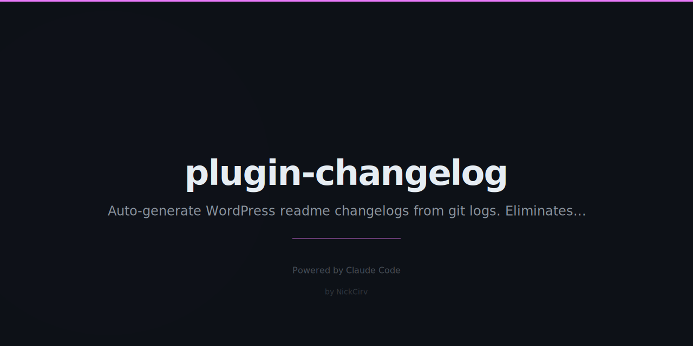

# plugin-changelog

Stop writing changelog entries by hand.

Your git log IS your changelog. This just formats it for WP.org.

```bash
cd my-plugin && node /path/to/plugin-changelog/index.js --version 1.1.0
```

*Paste into readme.txt. Done.*

---

## Install

```bash
# Clone and use directly
git clone https://github.com/NickCirv/plugin-changelog
node plugin-changelog/index.js --version 1.1.0

# Or install globally via npm link
cd plugin-changelog && npm link
plugin-changelog --version 1.1.0
```

---

## Usage

```
plugin-changelog [options]

Options:
  --version <ver>   Version string (e.g. 1.1.0)
                    Auto-detects from PHP header or package.json if omitted
  --since <ref>     Git ref to log from (e.g. v1.0.0, HEAD~20)
                    Auto-detects last tag if omitted
  --format <fmt>    wporg (default) | markdown | json
  --copy            Copy output to clipboard
  --append          Prepend entry into readme.txt changelog section
  --dir <path>      Plugin directory (default: cwd)
  --help            Show help
```

---

## Output Formats

### WP.org (default)

Ready to paste into `readme.txt`:

```
= 1.1.0 =
* Added: Schema markup for FAQ blocks
* Added: Support for WooCommerce product schema
* Fixed: Console error on pages with no schema
* Fixed: Compatibility issue with PHP 7.4
* Changed: Improved performance of schema generation
* Security: Sanitized user input in settings form
```

Drop this under your `== Changelog ==` section — or use `--append` to do it automatically.

### Markdown (`--format markdown`)

For GitHub releases and CHANGELOG.md:

```markdown
## [1.1.0] - 2026-03-02

### Added
- Schema markup for FAQ blocks
- Support for WooCommerce product schema

### Fixed
- Console error on pages with no schema
- Compatibility issue with PHP 7.4

### Changed
- Improved performance of schema generation

### Security
- Sanitized user input in settings form
```

### JSON (`--format json`)

For programmatic use or CI pipelines:

```json
{
  "version": "1.1.0",
  "date": "2026-03-02",
  "entries": {
    "Added": ["Schema markup for FAQ blocks"],
    "Fixed": ["Console error on pages with no schema"],
    "Security": ["Sanitized user input in settings form"]
  }
}
```

---

## Commit Prefix → Category Mapping

| Prefix | Category |
|---|---|
| `feat:`, `feature:`, `add:`, `added:`, `new:` | Added |
| `fix:`, `bug:`, `bugfix:`, `hotfix:`, `patch:` | Fixed |
| `change:`, `update:`, `improve:`, `refactor:`, `perf:`, `chore:`, `style:`, `ci:`, `build:`, `docs:`, `test:` | Changed |
| `remove:`, `delete:`, `drop:`, `deprecate:` | Removed |
| `security:`, `sec:`, `vuln:`, `cve:` | Security |
| (anything else) | Other |

All prefixes are case-insensitive. Conventional commit scopes like `feat(schema):` are supported.

---

## --append Mode

Automatically finds `readme.txt` (searches current dir + up to 3 parent dirs) and prepends your new version entry under the `== Changelog ==` section.

```bash
# Generate and inject in one step
plugin-changelog --version 1.2.0 --append

# Also copy to clipboard
plugin-changelog --version 1.2.0 --append --copy
```

If no `== Changelog ==` section exists, it creates one at the end of the file.

---

## Version Auto-Detection

If you skip `--version`, the tool checks in order:

1. PHP plugin header: `* Version: 1.2.3`
2. `package.json` version field

---

## Examples

```bash
# Basic — auto-detect version and last tag
plugin-changelog

# Specific version, since a tag
plugin-changelog --version 1.2.0 --since v1.1.0

# Markdown for GitHub release notes
plugin-changelog --format markdown

# Copy to clipboard, no file write
plugin-changelog --copy

# Full workflow: generate, append to readme.txt, copy to clipboard
plugin-changelog --version 1.2.0 --append --copy

# From a different directory
plugin-changelog --dir /path/to/my-wp-plugin --version 2.0.0
```

---

## Edge Cases Handled

- **No git tags**: Falls back to last 50 commits
- **No conventional commits**: Everything lands in "Other" — still useful
- **Empty range**: Warning printed, minimal output generated
- **Missing readme.txt**: Clear error with fallback instructions
- **No clipboard tool**: Warning printed, output still written to stdout
- **Scoped commits** (`feat(schema): ...`): Scope stripped, message cleaned

---

## License

MIT
